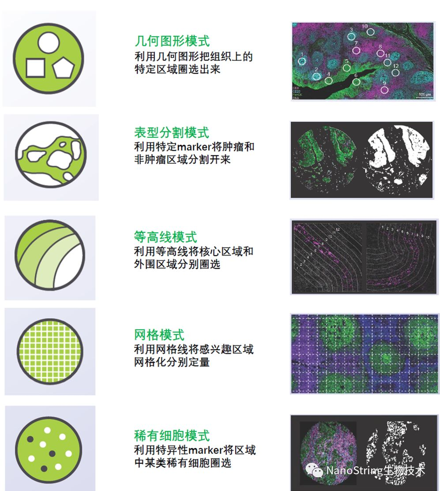
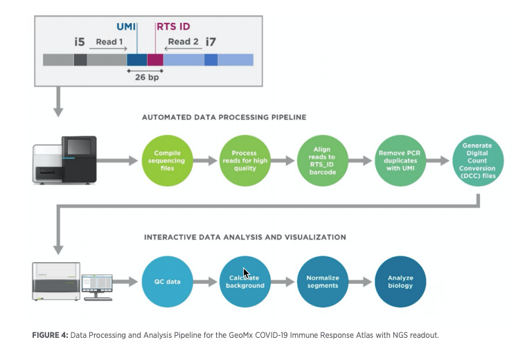

# NanoString空间转录组简介

>   将基因的表达情况与关注的组织切片的免疫化学染色图像进行整合，从而将组织内不同细胞的基因表达信息定位到组织的原始空间位置上去，进而直接观测组织中不同部位功能区基因表达的差异。空间转录组技术利用了常规的原位技术和组学技术两方面的优势。

## **GeoMx Digital Spatial Profiler**-DNA Oligo

### 原理

​		GeoMx Digital Spatial Profiler在抗体或者RNA上偶联DNA Oligo。每个DNAOligo对应一个靶标，最高可达96个蛋白靶标或>1000个RNA靶标（二代测序输出）。当抗体或RNA与组织上的靶标结合后，GeoMx DigitalSpatial Profiler利用激光切断DNA oligo与抗体或RNA之间的连接物，从而释放出DNA Oligo以进行下一步定量。

​		成像试剂（reagent）：4中荧光形态学fluorescent（morphology）marker

​		分子profiling试剂： 10-1000个RNA或protein检测试剂barcode，有唯一光切除olig

### 过程

1.  多靶标抗体染色

2.  根据荧光抗体染色图像挑选感兴趣区域（Region of Interest, ROI）

3.  对每个ROI进行UV照射，切割下Oligo

4.  毛细管吸取仅限于ROI的Oligo,全程与样本无直接接触

5.  吸取的Oligo转移至96孔板中。

6.  步骤3-5会重复直至所有ROI的Oligo都收集完毕

7.  所有ROI中的Oligo分别收取完后，将在NanoString生物技术的nCounter上进行定量

*荧光抗体及靶标抗体在同一步骤染色，无需重复加样和染色

*步骤4-6为全自动操作，无需研究人员操作。

### 特点

1.  高精度

    激光激活的精度范围最小为10微米，可达到单细胞水平。可以对极其稀有的细胞群体进行捕获。

2.  样本无损

    整个操作过程于样本无接触无损伤。同一样本可以重复使用并用于其他实验。

3.  多组学

4.  多样本

    与新鲜冷冻切片兼容，也与福尔马林固定石蜡包埋（FFPE）样本兼容

## 分子条码技术

### 原理

1.  报告探针包含4种6个颜色的barcode
2.  捕获探针（capture probe）

## 数据处理

>   数据处理的一般模式包括原始数据的质量控制和下游分析之前的标准化

---

1.  对照

    -   对照用于QC和归一化
    -   隐性对照、阳性对照、不同housekeepers等

2.  原始数据质量控制

    -   使用Illumina对每个基因的多个探针进行杂交和测序

    -   在测序准备阶段产生的PCR重复物被生物信息移除（去除PCR duplicates）

    -   返回每个探针的读取次数

    -   多目标探针可以在RNA降解时进行精确定量（可能存在一个基因对应有多个探针，即可能**重复**）

    -   离群值检测方法可以用来在给定基因中识别应该移除的探针（离群）

    -   将原始数据与阴性对照分子进行比较，可以揭示基因之间具有不同的信噪比(SNR)（差异表达）

    -   估计SNR的目的是识别出在背景表达以上表达的基因（**差异表达基因**）

    -   使用SNR筛选基因时，需要考虑ROI的选择、掩蔽masking和整体实验设计

        >   如果比较来自不同组织(肺和肝)的样本，研究的目的可能是希望发现在不同类型组织中不会高表达（不会在不同组织同时高表达，衡量表达）
        >
        >   比较COVID-19病人肺样本和正常健康肺对照，SARS-CoV-2 病毒基因的表达可能仅在COVID-19样本中升高
        >
        >   **建议：**确保任何给定的基因或蛋白质，其表达在生物驱动的样本子集中始终高于背景

3.  归一化 Normalization

    >   由nCounter或NGS读出产生的计数count需要标准化，以考虑样品输入量、RNA质量、检测效率和其他技术因素

    -   没有一种归一化方法适用于所有的实验设计和下游分析，但确保**归一化因子与感兴趣的因素不相关**是一种良好的实践

    -   对于基于蛋白质的研究，比较阴性对照和管家基因内部和之间的一致性可以确定最佳的标准化策略

    -   对于基于RNA的研究，流行的标准化方法包括基于以下标准的数据:

        1) 阴性探针或生物对照的平均值

        2) 管家基因的平均值

        3) 基因的上四分位数

        为了确保有意义的空间洞察力，有必要检查标准化因素是否与你的生物学问题的因素混杂或相关。

4.  更多介绍

    >   Introduction to GeoMx Normalization: Protein. Available at: https://www.nanostring.com/support/product-support/support-system

5.  更多分析

    -   降维或者聚类

        一个有用的首要策略是在低维空间中可视化规范化数据，以识别感兴趣的组内或跨组的集群，并发现任何注释错误和高层次的集群/分组(例如，PCA)

        另一种有用的可视化方法是使用跨AOIs和组的任何感兴趣的基因的分层聚类。

        GeoMx热图(图5B)也可用于识别Covid-19样本是否为一套基因聚集在一起。

    -   差异表达

        基因和蛋白质的表达可以在组间进行比较，结果通常用火山图来总结，其中x轴表示组间的log2倍变化，y轴表示显著性(图5C)25。

        有几种实现差分表达式分析的方法，它们因模型假设和所使用的规范化方法的类型而不同。Wang等人2019年强调了基于计数的数据的不同方法22。由于在GeoMx中可以为给定的单个组织选择多个roi，一个重要的统计考虑因素是，样本可能不是独立的观察结果，因此可能需要使用混合效应模型。与RNAseq数据一样，如果您的数据包含离散计数，那么使用负二项混合效应模型分析基于geomx的RNA数据可能更合适

        

    -   基因集富集分析(GSEA)

        上面的差异表达分析通常是在每个基因或每个蛋白质的基础上进行的。这可能导致几个显著不同的特征和校正的多个假设检验是首选的绘图推论。然而，基因和蛋白质在网络或通路中相互作用，在其中许多特征的微小变化可能被发现，但在差异表达中却没有被发现。GSEA是一种统计方法，用于检查生物通路或基因组26，可以使用GeoMx DSP数据实现(图5D)。GSEA的**目标是确定焦点基因是否随机出现在所有基因的排序列表中**，或者焦点基因是否偏向于排序列表的顶部或底部26。换句话说，GSEA被用来识别一个**给定的基因或功能组是否在不同的表型中有差异表达**27 28。

    -   用SpatialDecon算法估计细胞丰度。

        NanoString开发了SpatialDecon算法来量化每个ROI15中检测到的细胞数量。该算法将从单细胞RNA测序数据计算出的预先指定的细胞类型表达谱与GeoMx数据整合起来，以估计相对细胞丰度。最近的一项COVID-19研究使用该算法调查了与病毒位置相关的免疫细胞类型分布，发现不同病例免疫反应的空间异质性2。
        
        

### 专业术语

raw reads：呈现在FASTQ文件reads数目，它表示通过流通池通滤器的读取数。GeoMx NGS Pipeline以FASTQ文件开始。

**修整后的读数**：删除adapter序列

**拼接读取**：从读取1和读取2的重叠序列中创建一个共有读取（双链拼接）

**对齐阅读**（比对）：将RTS-ID映射到代表目标的序列白名单

**重复数据删除读取**：基于UMI删除PCR重复数据以进行数字计数

**UMI**：唯一分子指数Unique Molecular Index。唯一识别每个DNA分子的分子条形码。在PCR扩增过程中，所有重复的分子均包含该条形码。

---

### 提供测试数据集（[GeoMx NGS Pipeline Dataset Package](https://blog.nanostring.com/files/geomx-software-updates/v2.1/GeoMx-NGS-Pipeline-Dataset.zip)）

>   This sample dataset contains NGS data for **three samples** (wells). The three wells represent **two collected AOI’s (**area of illumination) and one NTC (no-template control) from a GeoMx DSP experiment.

1.  Each sample has eight FASTQ files

2.  Sequencing saturation was between 70% and 80% ((1 – raw reads/deduplicated reads) x 100)%.

3.  数据来自使用成对端运行的NextSeq的4个通道——所以每个样本有正向和反向读取X 4通道。

4.  文件说明

    | FILE/FOLDER                                     |                         DESCRIPTION                          |
    | :---------------------------------------------- | :----------------------------------------------------------: |
    | **3sampleAOIs_20201119_GeoMxNGSPipelinev2.ini** | The configuration file downloaded from the GeoMx DSP instrument. This file is required by the GeoMx NGS Pipeline v2.0 app to process the FASTQ files. |
    | Subfolder: **/FASTQ/**                          | Folder containing FASTQ sequencing data from Illumina NextSeq. 8 files per sample (forward & reverse x 4 Lanes), 24 FASTQ files total. |
    | Subfolder: **/Run1DCCs/**                       | Contains Summary of output, DCC zip file for upload to DSP DA, and sub-folder with DCC output from *NanoString*Contains Summary of output, DCC zip file for upload to DSP DA, and sub-folder with DCC output from *NanoString* for comparisons. |
    | Subfolder: **/Run1DCCs/DCC_Files/**             |       The DCCs files to compare with customer test run       |
    | **/Run1DCCs/summary.txt**                       | Summary of number of raw, trimmed, stitched and aligned reads for each sample |
    | **/Run1DCCs/DCC-20201119.zip**                  | Sample of the DCC package which would be uploaded back to your GeoMx DSP |
    | Subfolder: **/Run1DCCs/logs/**                  |                      Logs from pipeline                      |
    | Subfolder: **/Run1DCCs/Stats_Files/**           |     Statistics files from the pipeline run for each AOI      |

5.  3sampleAOIs_20201119_GeoMxNGSPipelinev2.ini 作为配置文件

6.  FASTQ folder 为输入文件夹

